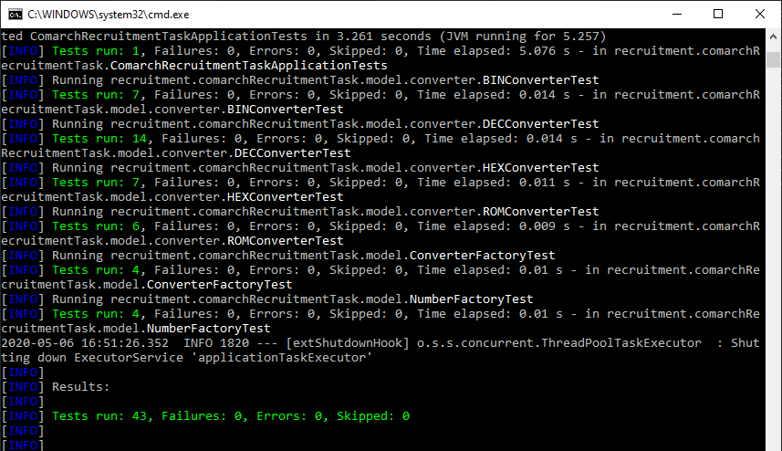

 # NumberConverter API
 NumberConverter jest to API pozwalające na konwersję liczb pomiędzy systemami liczbowymi. 

 ## Technologie
- Język : JAVA 8
- Framework : SPRING BOOT
- Zarządzanie Zależościami : MAVEN
- Testy Jednostkowe : JUnit 5 
  
 ## Uruchamianie

 ### Wymagania wstępne
-  Zainstalowana Java 8
-  Zainstalowany MAVEN
### Windows
 Aby uruchomić API na systemie Windows, należy:
  
  1. Uruchomić znajdujący się w katalogu głównym skrypt _compile.bat_, który utworzy archiwum JAR.
  2. Uruchomić skrypt _run.bat_, który uruchomi API.


 ## Zapytania HTTP
 Jedynym zapytaniem HTTP, które jest obsługiwane przez API jest zapytanie GET, które wysyła się na endpoint _api/converter_. Domyślnie jest on wystawiony na porcie 8080.

 ## Dane Wejściowe
Zapytanie GET musi zawierać w swoim body JSON o następującej strukturze. 

```yaml
{
   "numberValue": "wartość liczbowa będąca liczbą Naturalną",
   "numberType": "system liczbowy, w którym zapisana jest liczba",
   "conversionType": "system liczbowy na jaki ma zostać przekonwertowana liczba"
} 
```

W aktualnej wersji obsługiwane są 4 systemy liczbowe, każdy z nich posiada 3-znakowy kod reprezentujący go w systemie.

  System Liczbowy | Kod Systemowy | Przyjmowane Wartości
  --- | --- | ---
  System Dziesiętny | DEC | 0 - $\infty$
   System Szesnastkowy | HEX | 0 - $\infty$
   System Binanarny | BIN | 0 - $\infty$
   System Rzymski | ROM | 1 - 3999
  
 ### Przykładowe zapytanie:
```yaml
{
    "numberValue": "2255",
    "numberType": "DEC",
    "conversionType": "BIN"
}
```
## Dane Wyjściowe
Jeżeli wszystko przebiegnie pomyślnie, API zwraca JSON z dwoma polami, reprezentującymi liczbę oraz system w jakim są zapisane.

### Odpowiedź na przykład

```yaml
{
    "number": "100011001111",
    "type": "BIN"
}
```

## Błędy
API zostało przygotowane na wszystkie możliwe błędy związane z błędnymi danymi wejściowymi. W każdym z tych przypadków zwraca status **BAD_REQUEST**, wiadomość, w której opisany jest błąd, oraz czas otrzymania zapytania.

Przykłądowy błąd:

```yaml
{
    "message": "JSON field : numberValue can't be empty.",
    "httpStatus": "BAD_REQUEST",
    "zonedDateTime": "2020-05-06T16:45:53.331+02:00"
}
```

## Testy
Do aplikacji zostały napisane testy jednostkowe, testujące podstawowe funkcje. Zostają one automatycznie uruchomione podczas kompilacji skryptem _compile.bat_

 


### Seria Testów XXXConverterTest
Są to testy, których zadaniem jest sprawdzenie działania konwersji. Sprawdzają, czy w przypadku dobrych danych podają dobre wyniki, oraz czy w przypadku błędnych, zwracają odpowiednie błędy.
### Seria Testów FactoryTest
Są to testy, które sprawdzają czy aplikacja odpowiednio tworzy obiekty odpowiedzialne za Liczby oraz Konwersję.
